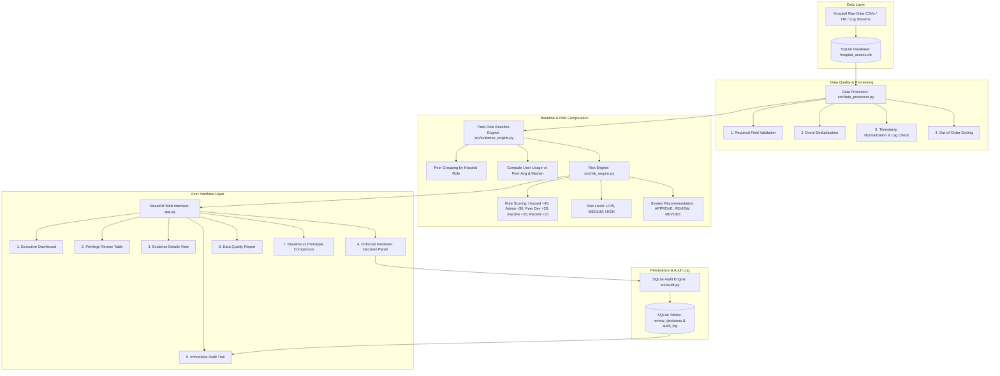

# System Architecture Documentation

This document outlines the system architecture, data processing pipeline, and component interactions of the Evidence-Based Hospital Access Review System.

---

## 🏗️ High-Level System Flow

```
Hospital Data
     ↓
Data Validation
     ↓
Event Processing
     ↓
Evidence Engine
     ↓
Risk Engine
     ↓
Streamlit Dashboard
     ↓
Reviewer Decision
     ↓
Audit Trail
```

---

## 📊 Mermaid Architecture Diagram



---

## 🔍 Detailed Component Descriptions

### 1. Hospital Data Ingestion Layer (`src/database.py`)
- Ingests hospital staff profiles (`users`), assigned access entitlements (`entitlements`), and application access events (`usage_events`).
- Stores relational data cleanly inside `database/hospital_access.db` using SQLite.

### 2. Data Validation Layer (`src/data_processor.py`)
- Evaluates raw event payloads for missing mandatory attributes (`user_id`, `application`, `action`).
- Validates timestamp parseability without crashing the ingestion pipeline on corrupt rows.
- Routes invalid records to a segregated `invalid_events` collection.

### 3. Event Processing & Normalization Layer (`src/data_processor.py`)
- Performs deduplication on `event_id` and duplicate event payloads to prevent double-counting usage statistics.
- Calculates log ingestion lag by comparing `event_timestamp` with `received_timestamp`.
- Re-orders log events chronologically by `event_timestamp` to resolve out-of-order log arrival.

### 4. Peer-Role Baseline Evidence Engine (`src/evidence_engine.py`)
- Groups users by identical hospital role (Nurse vs Nurse, Consultant vs Consultant, Intern vs Intern, Lab Technician vs Lab Technician).
- Computes `user_usage`, `last_usage_date`, `peer_average`, `peer_median`, and `difference_from_peer` per entitlement.
- Generates evidence codes (`UNUSED_PRIVILEGE`, `HIGH_PRIVILEGE`, `LOW_USAGE_VS_PEERS`, `HIGH_USAGE_VS_PEERS`, `INACTIVE_USER`).

### 5. Risk Scoring Engine (`src/risk_engine.py`)
- Applies transparent, deterministic security rules (No machine learning / black-box AI):
  - Unused privilege = `+40`
  - ADMIN permission = `+30`
  - Usage significantly below peer baseline = `+20`
  - Inactive user account = `+20`
  - Recently granted privilege (< 30 days) = `+10`
- Classifies entitlements into risk levels: `0-29` (LOW), `30-59` (MEDIUM), `60+` (HIGH).
- Formulates actionable system recommendations (`APPROVE`, `REVIEW`, `REVOKE`) with human-readable rationale.

### 6. Streamlit Dashboard MVP (`app.py`)
- Presents executive metrics, Plotly distribution charts, filterable privilege tables, detailed evidence breakdown cards, and role baseline comparisons.

### 7. Reviewer Decision Workflow (`app.py` & `src/audit.py`)
- Enforces evidence card review before decision submission.
- Accepts decisions: `APPROVE`, `REVOKE`, `MODIFY`, `OVERRIDE`.
- Enforces a mandatory justification reason when `OVERRIDE` is selected (`override = TRUE`).

### 8. Immutable Audit Trail (`src/audit.py`)
- Writes every reviewer decision, timestamp, override flag, and comment into the SQLite `audit_log` table.
- Preserves full historical trace; multiple reviews of the same entitlement remain permanently available.
